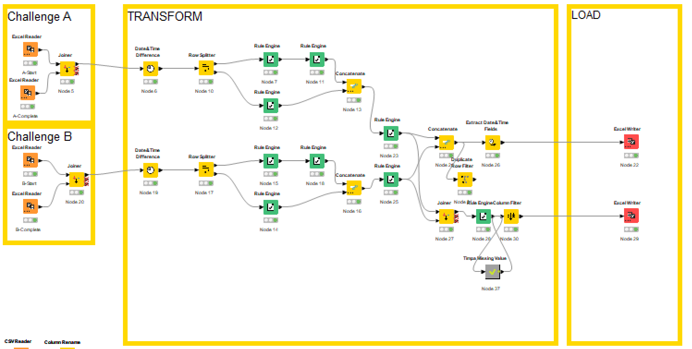
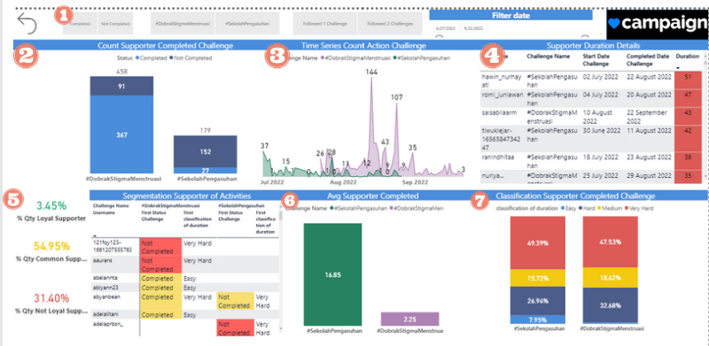

# Analyzing Unresolved Challenges: Understanding Supporter Engagement and Uncompleted Tasks

## Bussiness Understanding

In the dynamic landscape of digital marketing, campaign.com, a startup specializing in social digital campaigns, faces unique challenges in achieving its campaign goals. Despite their innovative approach and concerted efforts, certain challenges remain unaddressed, resulting in suboptimal campaign outcomes. Understanding these issues is crucial to refine strategies, optimize resource allocation, and ultimately enhance campaign success.

## Problem Statements

Despite its innovative approach and efforts, campaign.com, a startup specializing in social digital campaigns, faces persistent challenges that hinder the achievement of its campaign goals. These challenges include difficulties in identifying the right target audience, maintaining content relevance, selecting effective distribution channels, measuring campaign success, and optimizing budget allocation. The root causes of these challenges could be attributed to insufficient data analysis, communication gaps, resource constraints, changing trends, and a lack of experimentation.

## Goals

In order solve the problems, as a Data Analyst our team are proposing some objective in order to pull off that goals, as follows:

1. Develop advanced audience segmentation techniques based on demographic, behavioral, and engagement data. By identifying distinct audience segments, I can help tailor campaigns for maximum relevance and impact.
2. Utilizing statistical techniques and data visualization, my goal is to analyze campaign data to uncover insights and trends. I aim to identify what strategies are working well and where improvements are needed.
3.  Design and conduct A/B tests to evaluate different campaign variations. By systematically experimenting with different approaches, I can contribute to refining campaign strategies and identifying best practices.

## End-to-End Schema with ETL Processing with KNIME

## Data Visualization Dashboard

1. **Filtering / Slicing:** Filter by challenge name, filter by supporters who have not yet/finished the challenge, filter by supporters who chose 1/2 challenges, filter by date.

2. **Total Supporter Insights:** Determine the total number of supporters who contributed and the percentage who completed or didn't complete the challenge.

3. **Action Tracking Over Dates:** Track the count of actions taken over specific dates.

4. **Challenge Duration Classification:** Calculate the number of days taken to complete 1 challenge and classify it: red = very hard (> 20 days), yellow = medium (between 11 and 20 days), green = easy (< 10 days).

5. **Supporter Classification for Challenge Completion:** Classify supporters to determine their challenge completion activity: red = Not Loyal (never completed a challenge), yellow = Common (supporters who completed only 1 challenge), green = Loyal (supporters who completed 2 challenges).

6. **Average Challenge Completion Time:** Calculate the average time taken to complete challenges.

7. **Percentage of Supporter Classifications Based on Completion Time:** Determine the percentage of supporter classifications based on challenge completion time.

## Insight
Data visualization we used in this project are entirely built on Power BI, using this following services:
1. **Supporter Achievement Insights:** Based on supporter achievements, it appears that challenges with a higher number of supporter actions tend to have a lower completion rate. Supporters are less likely to choose or complete challenges that require a significant number of actions.

2. **Challenges Difficulty Level:** A significant number of supporters are still struggling to complete challenges, indicating that the challenges might have a level of difficulty that needs to be addressed.

3. **Significant Action Disparity:** There is a notable disparity in the number of actions among different challenges. While Challenge A has 3 actions, Challenge B requires 7 actions, indicating a substantial difference in the engagement levels and complexity of the challenges.

## Suggest
Follow-Up Activities for Supporters Choosing Challenges:

Engaging supporters who have chosen challenges is essential for improving completion rates and maintaining a positive supporter experience. Implementing effective follow-up activities can foster commitment and encourage active participation. 

Do A/B Testing
Certainly, here's a brief outline of the A/B testing process:

1. **Hypothesis:** Formulate a hypothesis about what change could improve supporter engagement. For example, changing email reminders might boost engagement.

2. **Segmentation:** Divide supporters into two groups: Control (Group A) and Variant (Group B).

3. **Change Implementation:** Apply the proposed change (e.g., new email timing) to the Variant group.

4. **Data Collection:** Monitor engagement metrics (actions, completion rates) for both groups over a specific timeframe.

5. **Analysis:** Compare engagement metrics between the Control and Variant groups to determine if the change had a significant impact.

6. **Conclusion:** Based on the analysis, decide whether the change positively affected engagement. Implement successful changes and iterate as needed.

7. **Ethical Consideration:** Ensure the testing respects supporters' experiences and maintains transparency.

Remember, A/B testing can provide insights, but consider the broader context of your campaign and supporters' preferences.